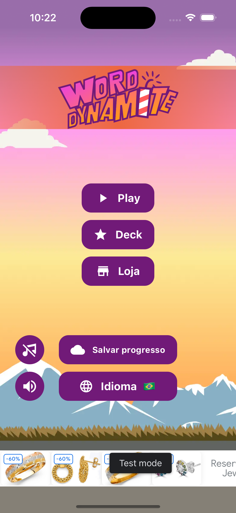
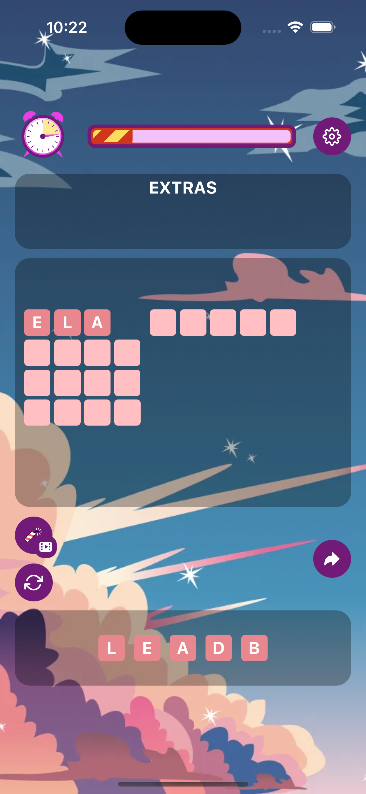
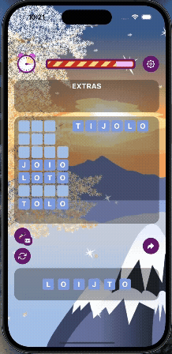
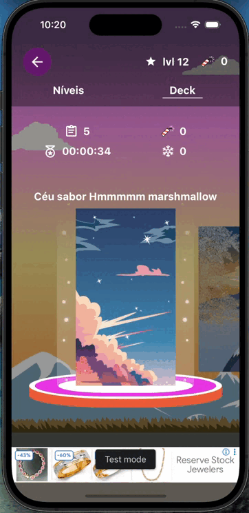

<p align="center">
  
</p>

<h1 align="center">Word Dynamite</h1>

<p align="center">
  <strong>Find the words. Light the fuse. Don't let time explode.</strong>
</p>

<p align="center">
  A word puzzle with dynamite, ice, and bonuses — offline-first, cloud-synced, and animated with Skia.
</p>

<p align="center">
  
  
  
  
</p>

<p align="center">
  
  
  
</p>

---

## Preview

<p align="center">
  
  &nbsp;&nbsp;
  
  &nbsp;&nbsp;
  
  &nbsp;&nbsp;
  
</p>

<p align="center">
  <sub>Home · Game · Board in action · Deck</sub>
</p>

---

## The game

**Word Dynamite** is a word puzzle where each level is a letter grid waiting to be solved. Build the right words, collect **dynamites**, break the **ice**, and chase the best time — with fuse, smoke, and explosion effects built in **Shopify Skia**.

|                       |                                                                                                           |
| --------------------- | --------------------------------------------------------------------------------------------------------- |
| **Play offline**      | Progress and balance live in encrypted SQLite; the sync queue uploads everything when the network returns |
| **Save to the cloud** | Guest, email, or Google — sign-in syncs identity and level history                                        |
| **Progress in Deck**  | Level blocks, history, and resume from where you left off                                                 |
| **Earn dynamites**    | Match bonuses, rewarded ads, and economy validated on the backend                                         |

---

## Stack

| Layer       | Technology                                                |
| ----------- | --------------------------------------------------------- |
| App         | React Native **0.78** · React **19** · TypeScript         |
| UI & motion | Reanimated · Gesture Handler · Linear Gradient · **Skia** |
| State       | Zustand · Contexts (Auth, Sound, Language, Error)         |
| Persistence | **op-sqlite** + **SQLCipher**                             |
| Auth        | Firebase Auth (anonymous, email, Google)                  |
| Backend     | REST API (Axios) + local sync queue                       |
| Ads         | Google Mobile Ads (banner, interstitial, rewarded)        |
| Analytics   | Firebase Analytics                                        |
| i18n        | i18next · react-i18next · react-native-localize           |

---

## Architecture (quick look)

```text
┌─────────────────────────────────────────────────────────────┐
│  Screens  ·  Components  ·  Hooks  ·  Stores (Zustand)      │
├─────────────────────────────────────────────────────────────┤
│  Services                                                   │
│    Auth · Levels · GameLifecycle · SyncWorker · i18n        │
├──────────────────┬──────────────────┬───────────────────────┤
│  @gt/api         │  @gt/firebase    │  @gt/database         │
│  REST (Axios)    │  Auth / Analytics│  SQLite + SQLCipher   │
│                  │                  │  + sync queue         │
└──────────────────┴──────────────────┴───────────────────────┘
```

**Offline-first:** matches and dynamite spends go into a local queue. `SyncWorker` processes by priority (e.g. `SYNC_LEVEL_PROGRESS`), with retry and handling for fatal network/server errors.

**Path aliases** (`src/`): `@screens`, `@components`, `@services`, `@stores`, `@gt/api`, `@gt/database`, `@gt/firebase`, `@animations`, …

---

## 🔐 Codebase & Architecture Access

> **Note on Source Code:**  
> The complete source code is hosted in a private repository as part of the commercial release strategy.
>
> This showcase repository serves to document the **software architecture, mobile offline-first strategy, custom animations, and state management patterns** implemented in the project. If you are a technical evaluator and would like to review code snippets or see a live demo, feel free to reach out via [LinkedIn](https://www.linkedin.com/in/ana-clara-cabral-ramos-31aa951a5/).

---

## Scripts

| Command        | What it does                    |
| -------------- | ------------------------------- |
| `yarn start`   | Metro bundler                   |
| `yarn android` | Run on Android                  |
| `yarn ios`     | Run on iOS                      |
| `yarn lint`    | ESLint                          |
| `yarn test`    | Jest                            |
| `postinstall`  | Apply patches (`patch-package`) |

---

## `src/` structure

```text
src/
├── screens/          # Home, Game, Deck, Login, Resume, …
├── components/       # Shared UI
├── services/         # Auth, Levels, GameLifecycle, sync/
├── gateways/
│   ├── api/          # HTTP
│   ├── database/     # SQLite + repositories
│   └── firebase/     # Auth / Analytics
├── stores/           # Zustand (session, level, ads)
├── contexts/         # Auth, Sound, Language, Error
├── navigation/       # Root stack
├── i18n/             # pt-BR · en-US · es
├── animations/       # Reanimated helpers
├── theme/            # Visual tokens
└── assets/           # Icons, sounds, backgrounds
```

---

## Product highlights

- **Guest → account:** play as a guest and link progress later (email or Google)
- **Dynamite economy:** local ledger + validation on `POST /levels/progress`
- **Ads:** banner, interstitial, and rewarded (AdMob; test IDs in `app.json` in dev)
- **Sound and music:** independent mute for SFX and soundtrack
- **Splash:** `react-native-bootsplash` — to regenerate from the logo:

```bash
npx react-native-bootsplash generate assets/bootsplash/logo.png \
  --background "#88b0c4" \
  --platforms android,ios
```

---

## Internal docs

- [`docs/user-sync-vs-levels-progress.md`](docs/user-sync-vs-levels-progress.md) — when to use `/user/sync` vs `/levels/progress`

---

## Learn more

- [React Native — Getting Started](https://reactnative.dev/docs/getting-started)
- [React Native — Environment Setup](https://reactnative.dev/docs/set-up-your-environment)
- [Firebase Auth](https://rnfirebase.io/auth/usage)
- [op-sqlite](https://ospfranco.github.io/op-sqlite/)
- [Shopify React Native Skia](https://shopify.github.io/react-native-skia/)

---

<p align="center">
  <sub>Built with a short fuse and a long coffee.</sub>
</p>
